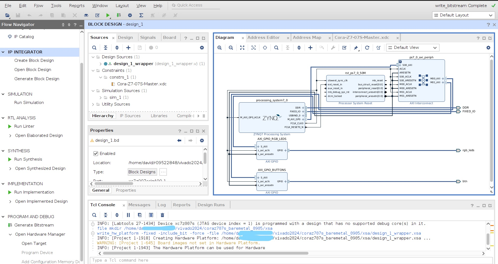

# Vivado + Vitis for CORA-Z7-07S

* Development Board: [Cora Z7-07S](https://digilent.com/reference/programmable-logic/cora-z7/start)
* Vivado and Vitis Version: 2024.1
* Blocks include LEDs and Buttons
* Start with <b>Vivado</b>, and then import ```*.xsa``` into your <b>Vitis</b> project. 

# command

```
source /Xilinx/Vivado/2024.1/settings64.sh
vivado
vitis --classic
```

* Block Design in Vivado


# source
* main tutorial
	* https://digilent.com/reference/programmable-logic/guides/getting-started-with-ipi
	* https://digilent.com/reference/programmable-logic/cora-z7/start
* xdc
	* https://github.com/Digilent/digilent-xdc/
* manual
	* https://digilent.com/reference/programmable-logic/cora-z7/reference-manual
